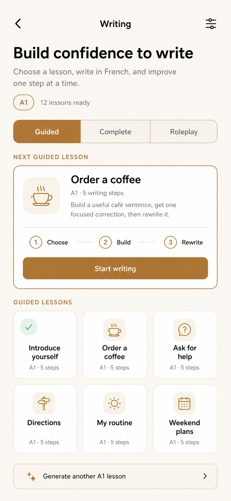
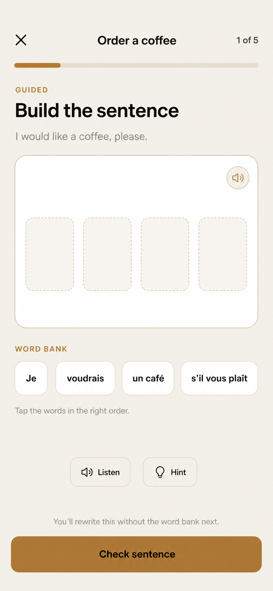
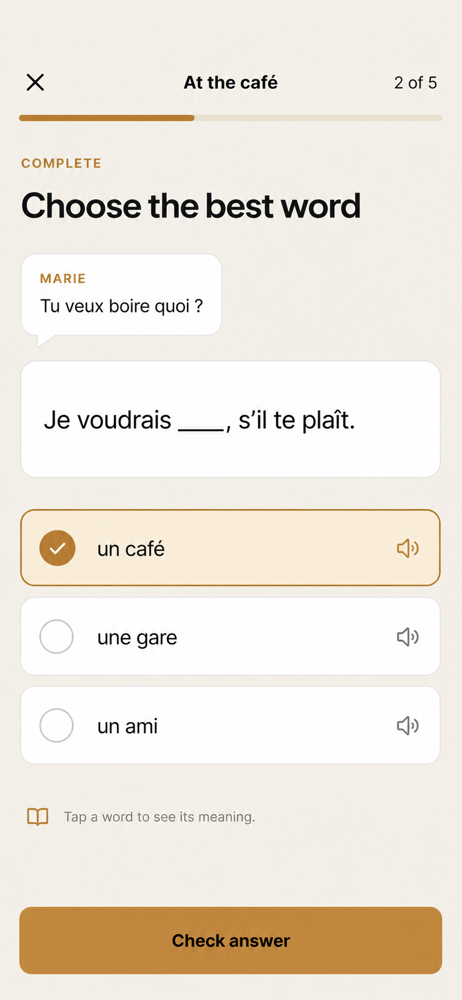
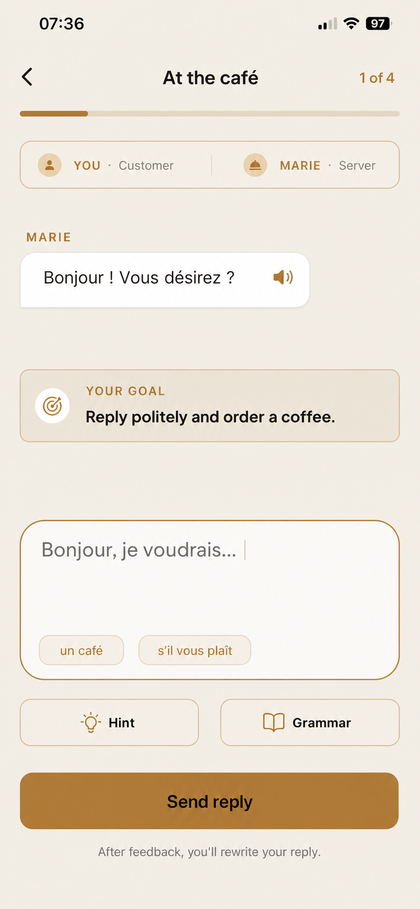

# Writing V2 — product wireframes and interaction contract

Status: implemented in the Flutter Writing V2 route. This document is the
interaction contract for the production review build.

## Product shape

Writing follows the same browsing model as Speaking:

```text
Writing home
  -> mode picker: Guided | Complete | Roleplay
  -> selected mode supplies one featured next lesson
  -> lesson cards select content without opening it
  -> featured card explains the selection and starts it
  -> completion returns to the same mode and selects the next incomplete lesson
```

The three Writing modes are deliberately different forms of production:

| Mode | Learner job | Learning purpose |
| --- | --- | --- |
| Guided | Build a useful sentence from progressively reduced support, then rewrite it | Move from recognition to recall without an empty editor |
| Complete | Choose or type the missing language that makes a sentence meaningful | Practise grammar, vocabulary, agreement, and contextual choice |
| Roleplay | Write a reply inside a bounded, pre-generated exchange | Transfer learned language into realistic written communication |

## Screen 1 — Writing home



Updated square-grid review state: [06-writing-home-square-grid.svg](screens/06-writing-home-square-grid.svg)

### Wireframe

```text
<                         Writing                         settings

Build confidence to write
Choose a lesson, write in French, and improve one step at a time.

[ A1 ]  12 lessons ready

[       Guided       |      Complete      |      Roleplay      ]

NEXT GUIDED LESSON
+--------------------------------------------------------------+
| Order a coffee                         A1 · 5 writing steps   |
| Build a useful café sentence, get one correction, rewrite it.|
|                                                              |
|       Choose       ->       Build       ->       Rewrite      |
|                                                              |
|                    [ Start writing ]                         |
+--------------------------------------------------------------+

GUIDED LESSONS
[ Introduce yourself ] [ Order a coffee ] [ Ask for help ]
[ Directions          ] [ My routine     ] [ Weekend plans ]

[ sparkle  Generate another A1 lesson                         > ]
```

### Behaviour

- Opening Writing restores the last selected mode; first run defaults to Guided.
- Switching mode updates the featured card, grid, lesson count, generation copy, and reserve check.
- Tapping a small lesson card selects it. It does not open immediately.
- The large card is the only primary start action and explains the selected lesson.
- The default featured lesson is the first incomplete lesson in the active mode and level.
- Completed lessons remain available and show a check; their CTA becomes `Practise again`.
- Manual generation is secondary and generates for the active mode and learner band.
- The lesson library uses the Speaking grid geometry: three equal columns,
  `1:1` square tiles, the mode icon at top-left, and completion state at
  top-right. Titles are one line with a two-line supporting subtitle so the
  card density remains consistent across Writing and Speaking.

## Screen 2 — Guided lesson



Updated Apple-quality guided state: [07-guided-writing-apple-tray.svg](screens/07-guided-writing-apple-tray.svg)

### Wireframe

```text
X                    Order a coffee                       1 of 5
[progress]

GUIDED
Build the sentence                                  [ phone ] [ mute ]

I would like a coffee, please.

[ Je ] [ voudrais ] [ un café ]                         audio

WORD BANK
[ Je ] [ voudrais ] [ un café ] [ s'il vous plaît ]

Tap the words in the right order.

              [ Listen ] [ Hint ] [ Translate ]

You'll rewrite this without the word bank next.
[                       Check sentence                         ]
```

The answer area is a flat, left-aligned tray rather than a fixed-height card.
It grows only when selected chips wrap, keeping the screen calm on both small
phones and larger text settings. There is no instructional line or decorative
rule before the word picker. The sentence speaker sits at the tray edge; the
Listen action uses the same cached clip. The compact phone icon starts or ends
the existing inline tutor helper; while active, a mute icon sits beside it.
The helper receives the current level, lesson, prompt, and target context. When
the learner advances, the new card context is injected silently so Marie is
ready without speaking or requiring a new call. Hint requests use the current
selected draft and fall back to the authored tip if the network is unavailable.

### Translation state (implemented)

The lesson footer keeps the same Speaking-style control on every mode:

```text
[ translate  Translation on ]                 [ Check sentence ]
```

Translation is on by default for a new lesson and can be turned off at any
time. When it is on, English is rendered as a small muted line in the source
prompt, word-bank/choice chips, and Marie's partner bubble. The selected answer
box stays French-only so the learner still has to assemble and recall the
French sentence. Word-bank chips are shuffled per step with a deterministic
seed; evaluation always compares the reconstructed canonical target.

### Lesson loop

1. `Choose`: learner orders supplied chunks.
2. `Build`: learner types the same sentence with only one starter or connector.
3. `Write`: learner produces a parallel sentence for a nearby situation.
4. `Feedback`: show at most two high-value corrections inline.
5. `Rewrite`: learner corrects the sentence before completion.

Hints reveal one chunk at a time. They never fill the complete answer. A valid
alternative is accepted even when it differs from the authored model.

## Screen 3 — Complete lesson



### Wireframe

```text
X                       At the café                       2 of 5
[progress]

COMPLETE
Choose the best word

MARIE
Tu veux boire quoi ?

+--------------------------------------------------------------+
|                 Je voudrais ___, s'il te plaît.              |
+--------------------------------------------------------------+

(selected)  un café                                      audio
( )         une gare                                     audio
( )         un ami                                       audio

book  Tap a word to see its meaning.

[                         Check answer                         ]
```

With translations on, the sentence prompt shows its English meaning beneath
the French sentence and each option shows its meaning beneath the option. The
missing answer is masked as `___` in the English prompt so translation helps
comprehension without giving away the choice. The translation never replaces
the French choice or changes the blank evaluation.

### Lesson loop

- Early A1 items use two or three choices.
- Later A1/A2 items move from a choice to a typed blank.
- B1/B2 items can complete connectors, register, tense, or a short clause.
- Tapping an option can reveal meaning, gender, audio, and one example without
  leaving the lesson.
- Incorrect answers stay on the same item and explain the contextual reason.
- A correct answer is followed by one short recall check with the choices
  removed before the item is considered learned.

## Screen 4 — Written roleplay



### Wireframe

```text
<                       At the café                       1 of 4
[progress]

[ YOU · Customer                       MARIE · Server ]

MARIE
+-------------------------------------------+
| Bonjour ! Vous désirez ?           audio |
+-------------------------------------------+

YOUR GOAL
Reply politely and order a coffee.

+--------------------------------------------------------------+
| Write a short reply in French...                             |
|                                                              |
| [ un café ] [ s'il vous plaît ]                              |
+--------------------------------------------------------------+

[ Hint ]                                      [ Grammar ]
[ translate  Translation on ]                [ Send reply ]
After feedback, you'll rewrite your reply.
```

Marie’s French line carries a compact English translation in the same bubble.
Suggestion chips use the same two-line treatment; the learner’s typed reply is
never overlaid with a translation.

The editor placeholder is intentionally generic (`Write a short reply in
French…`); the authored starter belongs in the separate Hint surface. A reply
that satisfies the goal but is not close to the model is accepted and marked
for improvement. The feedback shows a clearer version, while the sticky
footer offers `Redo reply` or `Next anyway`; rewriting is never forced.

### Roleplay contract

- The exchange is authored or pre-generated as a bounded scene with 3–6 beats.
- Marie's next message is selected from the scene plan, not invented as an
  unbounded generic chat.
- Each beat contains: partner line, learner goal, optional starter, optional
  phrase chips, acceptable intents, level guardrails, and the next partner line.
- Evaluation checks whether the learner achieved the communicative goal first,
  then returns at most two focused language corrections.
- The learner rewrites the reply when a high-value correction is present.
- Progress advances only after the goal is satisfied or the learner explicitly
  chooses a supported model answer after retries.

## Automatic reserve and regeneration

Writing mirrors the current Speaking reserve shape:

```text
on Writing open
on mode change
on lesson completion
on app/profile sync
  -> count incomplete validated lessons for active mode + level
  -> if remaining >= 2: do nothing
  -> if remaining < 2: silently generate 3 candidates
  -> validate, deduplicate, persist, and refresh the grid
```

Rules:

- Background replenishment never replaces the selected lesson.
- Background failures remain silent and retry at the next reserve check.
- Invalid or duplicate candidates are discarded rather than shown.
- Only one background replenishment job and one manual generation job may run
  at a time.
- The permanent bundled starter bank remains available offline.
- The low reserve floor intentionally leaves the original five lessons stable
  for product review and avoids spending generation credits before they are
  nearly exhausted.
- Manual generation creates one fresh lesson for the active mode and level,
  selects it after validation, and shows an explicit error if it fails.
- Generated lessons are stored before they appear, so tapping one never waits
  for another model call.

## Personalisation envelope

Every generation request receives a bounded snapshot, not unrestricted user
history:

```text
mode
CEFR level and pinned course level
learning goal (conversation, immigration exam, work, travel, daily life)
exam target and exam mode, when enabled
known vocabulary and recently learned vocabulary
current grammar unit and completed course units
recent recurring writing-error tags
saved correction phrases due for review
recent lesson topics and fingerprints to avoid
preferred interests/topics from onboarding
locale and French variety, when configured
requested lesson length and accessibility constraints
```

Generated steps must include aligned English meaning arrays:

```text
arrange  -> token_meanings      (one per token; punctuation may be blank)
choice   -> choice_meanings     (one per option)
roleplay -> suggestion_meanings (one per suggestion)
```

The validator rejects a lesson before persistence if an aligned meaning is
missing. This keeps generated A1–B2 content safe to show when the learner
turns translations on.

Personalisation priority:

1. Safety, schema, and mode contract.
2. Pinned CEFR difficulty.
3. Current course goal and grammar/vocabulary boundaries.
4. Recurring errors due for practice.
5. Interests and novelty.

Interests may change the setting, but must never make the language harder than
the pinned level. A1 remains concrete and short even when the learner chooses a
complex professional or exam goal.

## Validation before persistence

All generated lessons must pass:

- strict mode-specific schema validation;
- CEFR length, vocabulary, and grammar limits;
- exact step and beat counts;
- answerability and at least one valid solution;
- French/English alignment;
- acceptable-alternative coverage;
- no duplicate title, prompt, or semantic fingerprint;
- no answer accidentally embedded in an open prompt;
- no unsupported personal claims or sensitive scenarios;
- complete feedback and rewrite metadata.

Generation may retry up to three times. A lesson is persisted only after it
passes validation.

## Completion and review

A lesson is complete when the learner has produced or reconstructed language,
received focused feedback, and completed any required rewrite. Saved high-value
corrections enter spaced review and can reappear later as a Complete item or as
a Guided sentence with reduced support.
